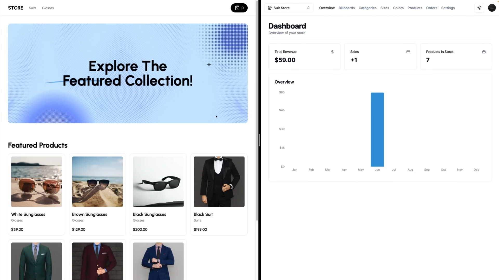

# [The Next Shop](https://the-next-shop-store.vercel.app/)

This is an e-commerce store front build with Next.js 14. It is bootstrapped with `create next-app`.

Checkout the Admin dashboard repository: https://github.com/devSaifur/the-next-dashboard

[](the-next-shop-store.vercel.app/)

## Tech Stack

- **Framework:** [Next.js](https://nextjs.org)
- **Styling:** [Tailwind CSS](https://tailwindcss.com)
- **UI Components:** [HeadlessUI](https://headlessui.com/)
- **Payments infrastructure:** [Stripe](https://stripe.com)

## Running Locally

1. Clone the repository

   ```bash
   git clone https://github.com/devSaifur/the-next-store.git
   ```

2. Install dependencies using pnpm

   ```bash
   pnpm install
   ```

3. Copy the `.env.example` to `.env` and update the variables.

   ```bash
   cp .env.example .env
   ```

4. Start the development server

   ```bash
   pnpm run dev
   ```
